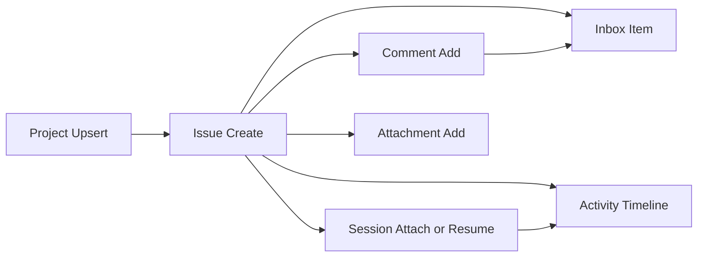

# Issues Core Developer Guide

**Maturity Tier:** `Hardened`

## Purpose And Architecture Role

`issues-core` is the collaboration control plane for the governed work OS. It turns projects, issues, comments, attachments, inbox routing, and resumable issue sessions into durable typed contracts so higher-level packs can coordinate people and agents without hiding collaboration state inside ad hoc workflow blobs.

## Repo Map

| Path | Role |
| --- | --- |
| `framework/builtin-plugins/issues-core` | Publishable plugin package. |
| `framework/builtin-plugins/issues-core/src` | Actions, resources, services, policies, and admin UI exports. |
| `framework/builtin-plugins/issues-core/tests` | Unit, contract, integration, and migration coverage. |
| `framework/builtin-plugins/issues-core/db/schema.ts` | Durable schema for projects, issues, comments, activity, inbox, attachments, and sessions. |
| `framework/builtin-plugins/issues-core/docs` | Internal domain docs backing the public repo docs. |

## Manifest Contract

| Field | Value |
| --- | --- |
| Package Name | `@plugins/issues-core` |
| Manifest ID | `issues-core` |
| Display Name | Issues Core |
| Kind | `plugin` |
| Review Tier | `R1` |
| Isolation Profile | `same-process-trusted` |

## Dependency Graph And Capability Requests

| Type | Value |
| --- | --- |
| Depends On | `auth-core`, `org-tenant-core`, `role-policy-core`, `audit-core` |
| Requested Capabilities | `ui.register.admin`, `api.rest.mount`, `data.write.issues` |
| Provides Capabilities | `issues.issues`, `issues.projects`, `issues.inbox`, `issues.sessions` |
| Owns Data | `issues.projects`, `issues.issues`, `issues.comments`, `issues.activity`, `issues.attachments`, `issues.inbox`, `issues.sessions` |

## Public Integration Surfaces

| Kind | ID | Purpose |
| --- | --- | --- |
| Action | `issues.projects.upsert` | Creates or updates a collaboration project container. |
| Action | `issues.issues.create` | Creates a governed issue with polymorphic reporter and assignee support. |
| Action | `issues.issues.assign` | Reassigns an issue and refreshes inbox routing. |
| Action | `issues.comments.add` | Adds a durable issue comment and optional notifications. |
| Action | `issues.attachments.add` | Adds an attachment reference to an issue. |
| Action | `issues.sessions.attach` | Attaches, resumes, or closes an issue-linked runtime session. |
| Resource | `issues.projects` | Project registry and queue defaults. |
| Resource | `issues.issues` | Issue inventory and assignee state. |
| Resource | `issues.comments` | Durable collaboration thread entries. |
| Resource | `issues.activity` | Issue activity timeline. |
| Resource | `issues.attachments` | External evidence and artifact links. |
| Resource | `issues.inbox` | Waiting-human, escalation, and assignment queues. |
| Resource | `issues.sessions` | Runtime resume metadata linked to issues. |
| Builder | `issue-builder` | Issue routing and status board authoring surface. |
| Builder | `project-builder` | Project and queue configuration surface. |

## Hooks, Events, And Orchestration

- `issues-core` is deliberately action-first. It does not expose a hidden hook bus.
- Inbox records are created as explicit state transitions during issue creation, assignment, and notify-on-comment flows.
- Issue sessions are durable records that higher-level automation or runtime plugins can resume without mutating issue state out of band.

## Storage, Schema, And Migration Notes

- Schema file: `framework/builtin-plugins/issues-core/db/schema.ts`
- Durable records cover projects, issues, comments, activity events, attachments, inbox items, and resumable sessions.
- The runtime implementation persists fixture-backed JSON state through `@platform/ai-runtime`, while the schema file documents the stable relational contract expected by real adapters.

## Failure Modes And Recovery

- Cross-tenant or unknown-project issue creation is rejected before state mutation.
- Session attach/resume fails closed when the issue does not exist.
- Assignment updates are idempotent by issue ID and overwrite the previous assignee cleanly.
- Comment notify fan-out is bounded to explicit actor IDs so inbox spam stays deterministic in tests.

## Mermaid Flows



## Integration Recipes

```ts
import { createIssue, attachIssueSession } from "@plugins/issues-core";

createIssue({
  tenantId: "tenant-platform",
  actorId: "actor-admin",
  issueId: "issue:ops-1",
  projectId: "project:pack0-ops",
  title: "Investigate approval drift",
  summary: "Escalated run needs human review.",
  priority: "high",
  queue: "queue:ops",
  reporterKind: "user",
  reporterId: "actor-admin",
  assigneeKind: "agent",
  assigneeId: "agent-profile:ops-triage"
});

attachIssueSession({
  tenantId: "tenant-platform",
  actorId: "actor-admin",
  issueId: "issue:ops-1",
  sessionId: "session:ops-1",
  workDir: "/workspaces/ops-1",
  runtimeId: "runtime:local-dev",
  mode: "resume"
});
```

## Test Matrix

- Unit: manifest invariants plus services for create, assign, comment, attachment, and session behavior
- Contracts: admin contributions and UI surface routes
- Integration: end-to-end project -> issue -> comment -> session -> inbox flow
- Migrations: schema coverage for every owned table contract

## Current Truth And Recommended Next

- Current truth: `issues-core` is the collaboration plane that closes the biggest Multica-class gap in the governed stack.
- Recommended next: add blockers/dependencies, richer mention routing, and signed project templates once the first operator workflows stabilize.
